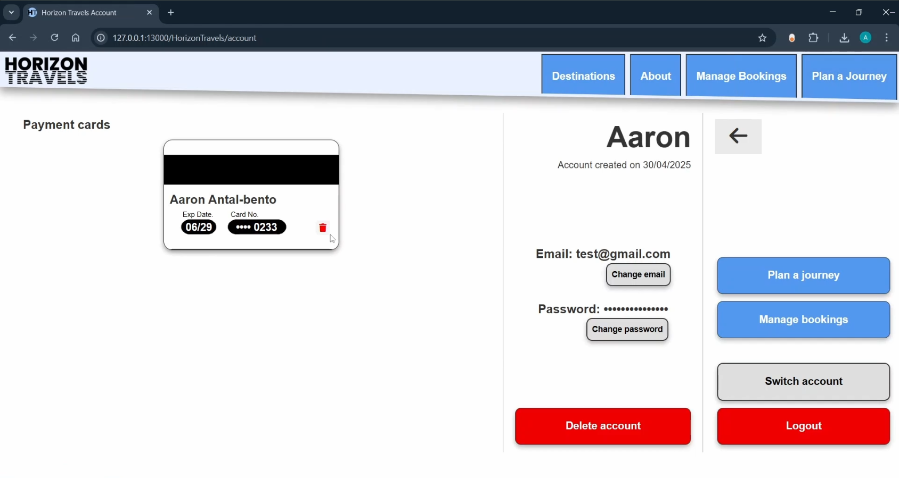
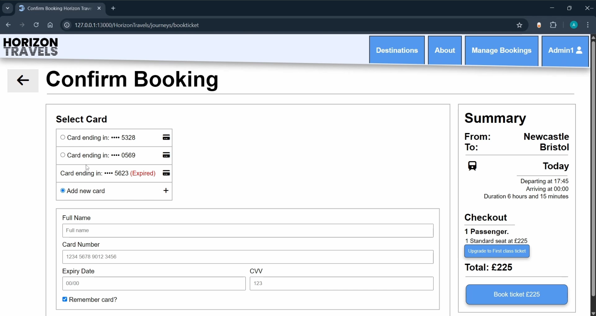

<h1>🌍 Horizon Travels Booking Website</h1>

A responsive full-stack web application developed as part of my web development coursework at UWE. 
The system is designed for Horizon Travels (HT) a UK-based travel company offering online booking for Air and Train journeys. 
The project allows customers to book travel, view destinations, and manage bookings, while providing admin tools for reporting and system management.

<h2>🎯 Features</h2>

<ul>
  <li><strong>End User Booking System</strong> - Users can search destinations, select travel dates, choose transport type (Air or Train), and complete bookings with instant receipt generation.</li>
  <li><strong>User Accounts</strong> - Register, log in/out, update password, view or cancel bookings, and view booking history.</li>
  <li><strong>Dynamic Pricing</strong> - Fares calculated based on travel mode, distance, and advance booking discounts.</li>
  <li><strong>Seat Classes</strong> - Economy, Business, and First-Class options, each with corresponding price multipliers.</li>
  <li><strong>Admin Dashboard</strong> - Manage users, journeys, fares, and generate reports such as monthly sales, top customers, and profitable routes.</li>
  <li><strong>Cancellation Policy Handling</strong> - Tracks booking cancellations and applies relevant refund or charge percentages.</li>
  <li><strong>Responsive Design</strong> - Optimized layout for desktop, tablet, and mobile devices.</li>
  <li><strong>Security Features</strong> - Authentication, input validation, and protected admin routes.</li>
</ul>

<h2>🎥 Demo</h2>

  <h4 align="center">Homepage</h4>
  
  
  <h4 align="center">Journey Select</h4>
  

  <h4 align="center">Sign Up Page</h4>
  

  <h4 align="center">Manage Bookings | Destinations and About Pages</h4>
  

    
    
  

<h4 align="center">Admin Controls</h4>

    
    
    

<h4 align="center">Responsive Web Design</h4>

    
    
    

<h4 align="center">Screenshots</h4>

  
  

<h2>⚙️ How It Works</h2>

<strong>From the User’s Perspective:</strong>

<ul>
  <li>Browse available destinations and view travel options.</li>
  <li>Select a travel mode (Air or Train) and input journey details (origin, destination, dates, passengers, etc.).</li>
  <li>The system displays available journeys with corresponding fares and discounts.</li>
  <li>Users sign up or log in to confirm bookings and generate a downloadable receipt.</li>
  <li>Users can later view, modify, or cancel their bookings under account management.</li>
</ul>

<strong>From the Admin’s Perspective:</strong>

<ul>
  <li>Admins can log in securely and access dedicated admin portal.</li>
  <li>Perform CRUD operations on journeys, fares, and user accounts.</li>
  <li>Generate analytical reports such as monthly sales, route profitability, and customer activity.</li>
  <li>Monitor booking statuses and manage customer accounts.</li>
</ul>

<h2>🧠 Technologies Used</h2>

<ul>
  <li><strong>Frontend:</strong> HTML, CSS, JavaScript</li>
  <li><strong>Backend:</strong> Python flask</li>
  <li><strong>Database:</strong> MySQL — normalized to 3rd Normal Form (3NF)</li>
  <li><strong>Frameworks:</strong> Bootstrap</li>
</ul>

<h2>🧩 Database Design</h2>

The database was designed following normalization principles:

<ul>
  <li>Transformed from Un-normalized Form → 1NF → 2NF → 3NF</li>
  <li>Tables: Bookings, Cardinfo, Company, Journeys, Traveldays, Users </li>
  <li>Links between tables to make sure each booking is correctly connected to the right user and journey</li>
</ul>

<h2>🖥️ Usage</h2>

Download the latest release:
<a href="https://github.com/Aaron-Antal-Bento/horizon-travels-booking-website/releases">HorizonTravelsWebsite.zip</a> 

Or clone the repository:

<pre><code>git clone https://github.com/Aaron-Antal-Bento/horizon-travels.git</code></pre>

Then:

<ul>
  <li>Follow the instructions in HT Website Instuctions.txt.</li>
  <li>Import the provided SQL database file into MySQL.</li>
  <li>Open the FlaskBackend.py file and execute the script.</li>
  <li>The website should run on your local host.</li>
</ul>

<h2>🧾 Evaluation</h2>

This project successfully implements a fully functional booking system meeting Horizon Travels’ requirements. 
Both user and admin perspectives are integrated, supported by a normalized relational database and responsive interface.
Security, usability, and data consistency were prioritized throughout development.

